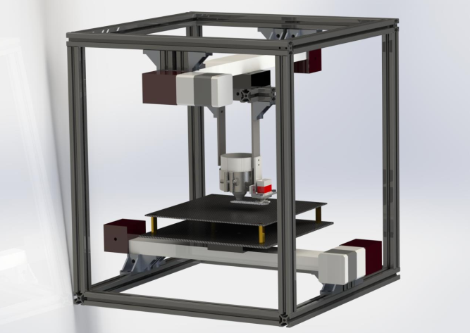
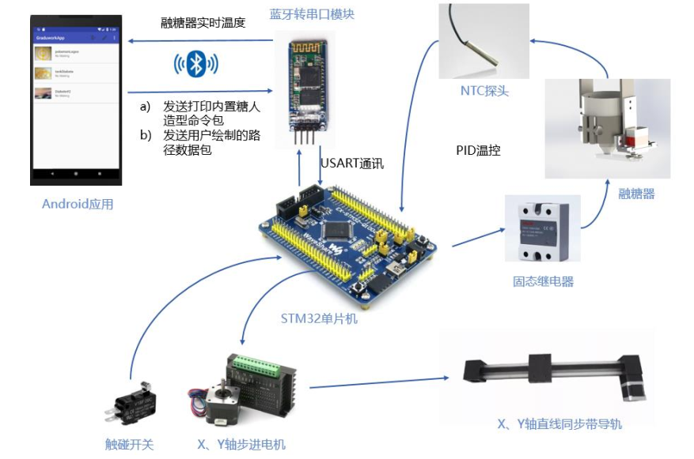
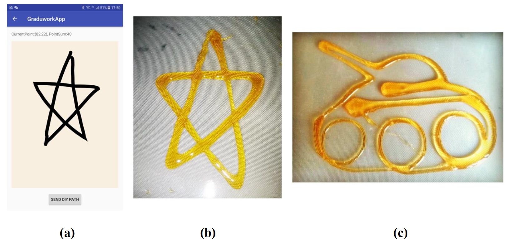
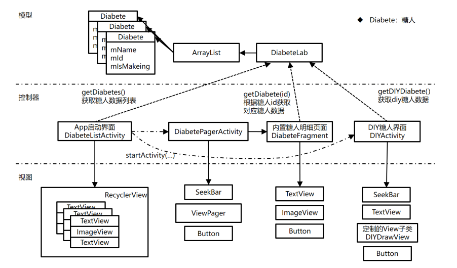
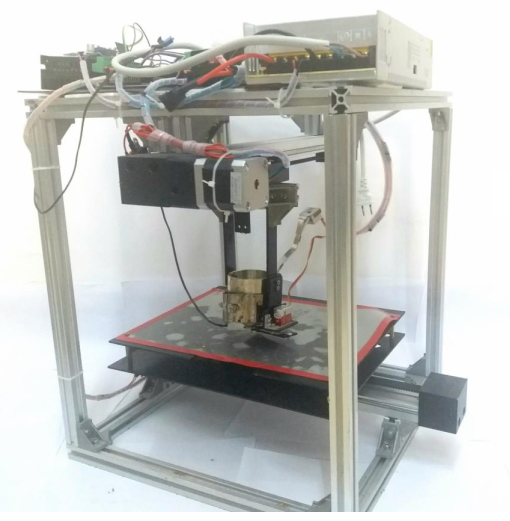

# 糖人的二维打印机

该项目于 2018.6 完成

## 简介 
糖人是中国传统食品，设计一款糖人自动打印机。

1. 融糖器用于将糖块融化并控制糖料的供给，以不锈钢加热圈为热源，实现四周均匀加热；通过 PID 算法对融糖器进行温控，使加热温度稳定在 120 摄氏度。

2. 设计二维移动平台，使用了 逐点比较法 作为打印机 x， y 轴电机的驱动控制算法，打印机以类似于雕铣机的加工方式绘制糖人的线条。

3. 制作 Android App 供用户操作打印机。应用通过蓝牙与打印机上的控制板（STM32F407）进行通讯。用户可以在手机屏幕上尽情设计糖人造型，并发送给糖人打印机进行制作。

4. `Android_App_Code` 是App的实现代码，`Stm32_Code` 是打印机控制主板的程序

SolidWork 设计图

----

硬件间连接

---

糖人打印机 APP

---

成品展示

---

## App设计

软件环境：Android Studio + Java

App基于 Model-View-Controller (MVC) 架构模式进行设计。

Diabete 实例代表一种糖人造型，保存了打印机中内置糖人造型的名字、id、是否正在制作等信息。其中用户 DIY 的糖人造型也是一个 
Diabete 实例，这些实例全部用一个列表 DiabeteLab 联系起来。

App设计

---

## 下位机软件
糖人打印机使用 STM32F407ZGTx 系列芯片作为控制主板

软件环境
IDE : MDK-ARM V5
package version: STM32Cube FW_F4 V1.24.2
FreeRTOS version: 10.0.1
CMSIS-RTOS version: 1.02

### App文件夹（应用层）
主板主要执行三个任务
1. 与App通讯任务 ：bluetooth_comm_task.c/h
2. PID 温控任务 ：temp_ctrl_task.c/h
3. 糖人线条绘制任务 ：draw_diabetes_task.c/h

### Bsp文件夹（驱动层）
1. 串口驱动 ：bsp_uart.c/h
2. PID算法 ：pid.c/h
3. 步进电机驱动 ：stepper_con.c/h，同时这个文件中还实现了基于 逐点比较法 的双电机联动

---

实物

